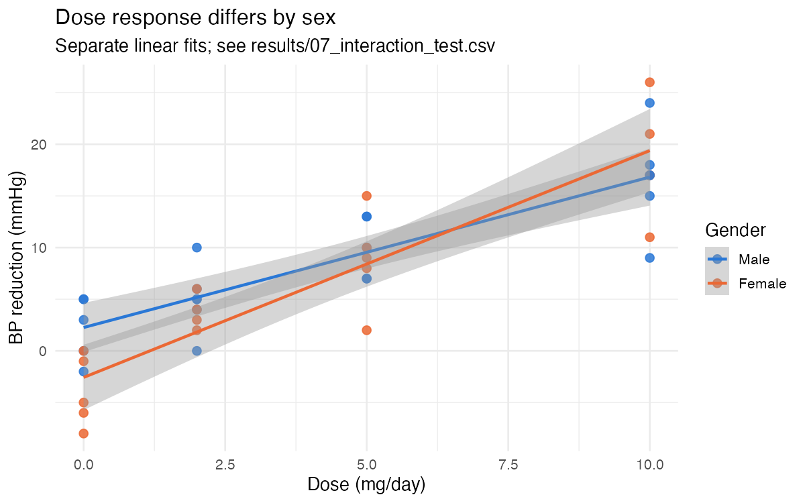

# Arginine Dose Response in Hypertension

[](../../actions/workflows/analysis.yml)
[](LICENSE)
[](https://www.r-project.org/)

A complete statistical analysis of a dose-finding trial: 40 hypertensive
patients (systolic BP ≥ 150 mmHg) randomised across four daily doses of arginine
— 0, 2, 5 and 10 mg — with systolic blood pressure reduction measured after two
months.

The headline result is a clean linear dose response of **1.79 mmHg of BP
reduction per mg/day**, 95% CI [1.44, 2.14]. The more interesting one is that
**the slope of that response differs between men and women** (interaction
p = 0.030) — a difference that is invisible to the additive model most analyses
of this dataset stop at.

Everything reproduces in about a second: `Rscript R/run_all.R`.

---

## Results



### Dose drives the response

| Dose (mg/day) | n | Mean BP reduction | 95% CI |
|---:|---:|---:|---|
| 0  | 10 | −0.9 mmHg | [−4.1, 2.3] |
| 2  | 10 | 4.5 mmHg | [2.6, 6.4] |
| 5  | 10 | 9.4 mmHg | [6.7, 12.1] |
| 10 | 10 | 17.5 mmHg | [13.7, 21.3] |

Dose and BP reduction correlate at **r = 0.859**, 95% CI [0.748, 0.924].
One-way ANOVA across the four arms gives **F(3, 36) = 35.42, p = 7.7 × 10⁻¹¹**.

Tukey post-hoc separates every pair of doses **except 2 mg versus 5 mg**
(adjusted p = 0.0565 — above the 0.05 threshold, so not separated):

| Comparison | Difference | Adjusted p |
|---|---:|---:|
| 2 − 0  | 5.4 mmHg  | 0.030 |
| 5 − 0  | 10.3 mmHg | 1.6 × 10⁻⁵ |
| 10 − 0 | 18.4 mmHg | < 10⁻⁷ |
| 5 − 2  | 4.9 mmHg  | **0.056** |
| 10 − 2 | 13.0 mmHg | 2 × 10⁻⁷ |
| 10 − 5 | 8.1 mmHg  | 5.7 × 10⁻⁴ |

The placebo arm's confidence interval contains zero, as it should. Every active
dose excludes it.

### The response is genuinely linear

Comparing a straight line in dose against dose as a four-level factor gives
**F(2, 36) = 0.585, p = 0.562**. The four-group model fits no better, so treating
dose as continuous is justified rather than merely convenient — which is what
licenses predicting at doses that were never administered.

Predicted mean BP reduction at **3 mg/day: 5.39 mmHg**, 95% CI [4.01, 6.78].

### The dose response differs by sex

| Model | R² | Adjusted R² |
|---|---:|---:|
| `bp.reduction ~ dose` | 0.739 | 0.732 |
| `bp.reduction ~ dose + gender` | 0.751 | 0.737 |
| `bp.reduction ~ dose * gender` | **0.782** | **0.763** |

The additive model reports sex as non-significant (p = 0.169) and stops there.
Adding the interaction changes the picture:

```
Response: bp.reduction
            Df  Sum Sq Mean Sq  F value    Pr(>F)
dose         1 1810.91 1810.91 121.7826 4.189e-13 ***
gender       1   29.25   29.25   1.9669   0.16934
dose:gender  1   75.90   75.90   5.1043   0.03002 *
```

- **Men:** 1.46 mmHg per mg/day, starting from a higher baseline
- **Women:** 2.20 mmHg per mg/day, starting lower and overtaking men above ~6.5 mg/day

The additive model forces one slope on both groups, so it can only ask "is one
sex offset from the other on average?" — and the answer to that is no. It cannot
ask whether they respond to dose at *different rates*, which is where the effect
actually lives. The scatterplot shows two non-parallel lines; only the
interaction model can represent them.

At 3 mg/day this separates the sexes by more than 2.5 mmHg:

| | Predicted reduction | 95% CI |
|---|---:|---|
| Men | 6.63 mmHg | [4.85, 8.41] |
| Women | 4.02 mmHg | [2.10, 5.93] |

<details>
<summary>The placebo-arm sex difference, and why it should not be trusted</summary>

Within the placebo arm alone, men and women differ significantly: means of
+2.2 and −4.0 mmHg, t(8) = 3.01, **p = 0.017**.

Three reasons to treat this as hypothesis-generating rather than as a finding:

1. It is a **placebo** arm. The expected effect is zero in both groups, so there
   is no mechanism for a real difference in drug response to appear here.
2. **n = 5 per cell.**
3. The same comparison across all 40 patients gives **p = 0.375**.

The interaction model explains the pattern better: what differs by sex is the
*slope*, not a constant offset, and at dose 0 the fitted sex gap is a baseline
intercept difference rather than a treatment effect.

</details>

<details>
<summary>All figures</summary>

| Figure | File |
|---|---|
| Gender distribution | `figures/01_gender_distribution.png` |
| Mean BP reduction by gender | `figures/02_mean_bp_by_gender.png` |
| Histograms of dose and BP reduction | `figures/03_histograms.png` |
| Scatterplot with per-sex regression lines | `figures/04_scatter_dose_bp_by_gender.png` |
| BP reduction by dose | `figures/05_boxplot_bp_by_dose.png` |
| Boxplots by gender | `figures/06_boxplots_by_gender.png` |
| Dose response by sex | `figures/07_dose_response_by_gender.png` |
| Outlier boxplot | `figures/08_outliers_boxplot.png` |
| Normality, whole sample | `figures/09_normality_overall.png` |
| Q-Q plots per dose | `figures/10_qq_by_dose.png` |
| Variance check | `figures/11_variance_check.png` |
| Confidence intervals | `figures/12_confidence_intervals.png` |
| ANOVA diagnostics | `figures/13_anova_diagnostics.png` |
| Tukey intervals | `figures/14_tukey_intervals.png` |
| Added-variable plots | `figures/16_added_variable_plots.png` |
| Residual diagnostics, per model | `figures/diag_m*.png` |

</details>

---

## Assumptions

The brief requires two methods for each assumption; all four groups and both
model families pass.

| Check | Method | Result |
|---|---|---|
| Normality, whole sample | Shapiro-Wilk | p = 0.806 |
| Normality, per dose | Shapiro-Wilk + Q-Q | all p > 0.6 |
| Equal variance by dose | Levene | p = 0.426 |
| Equal variance by dose | Bartlett | p = 0.270 |
| Equal variance by sex | Levene + F-test | p = 0.187, p = 0.145 |
| ANOVA residuals | Shapiro-Wilk | p = 0.463 |
| Regression residuals | Shapiro-Wilk + diagnostic plots | all p > 0.4 |

**A caveat that matters for how these are read.** With n = 10 per dose — and
n = 5 per sex within the placebo arm — Shapiro-Wilk has very little power. A
p-value above 0.05 at that sample size means the test could not detect
non-normality, not that the data are normal. The Q-Q plots carry most of the
weight, and the residual diagnostics in `figures/diag_m*.png` are the checks
that actually license the models.

---

## Reproducing

### Requirements

R 4.x and four packages:

```r
install.packages(c("car", "dplyr", "ggplot2", "RColorBrewer"))
```

Three further packages — `skimr`, `report`, `ggstatsplot` — add one extra
summary and one extra figure. They are loaded opportunistically: if they are not
installed, the analysis runs to completion without them.

### Run

```bash
git clone <this-repo>
cd Stat_Project
Rscript R/run_all.R
```

Around one second. Writes 20 figures to `figures/` and 15 CSV tables to
`results/`, plus `results/sessionInfo.txt` recording the exact package versions.

Individual steps:

```bash
Rscript R/run_all.R 06 07      # hypothesis tests and models only
```

No `setwd()` anywhere — paths resolve relative to the repository root, so the
analysis runs from any directory on any machine.

---

## Analysis structure

| Step | Script | Contents |
|---|---|---|
| 1 | `R/01_descriptives.R` | Summary statistics, frequency tables, correlation |
| 2 | `R/02_graphics.R` | Every figure required by the brief |
| 3 | `R/03_outliers.R` | Three detection rules; nothing is removed |
| 4 | `R/04_assumptions.R` | Normality and homoscedasticity, two methods each |
| 5 | `R/05_inference.R` | 90 / 95 / 99% confidence intervals per dose |
| 6 | `R/06_hypothesis_tests.R` | Three hypotheses, ANOVA, Tukey post-hoc |
| 7 | `R/07_linear_models.R` | Five models, diagnostics, lack-of-fit, predictions |

`R/00_setup.R` holds paths, data loading and shared helpers, and is sourced by
every step.

### Notes on test specification

**Hypothesis 2 is one-sided.** The brief asks whether BP reduction is *higher*
at 10 mg than at placebo — a directional claim, tested with
`alternative = "less"` (p = 7.0 × 10⁻⁸). A two-sided test does not support a
directional conclusion.

**Hypothesis 2 uses Welch.** The brief specifies "assuming heteroscedasticity",
so the unequal-variance test is the answer; the pooled-variance result is
reported alongside it only to show the conclusion does not turn on that choice.

**`gender` has no codebook.** It arrives as integer 0/1. This analysis reads 0 as
Male and 1 as Female, following the original. Every sex-related result depends on
that assumption, which is why it is stated here rather than buried in the code.

---

## Repository layout

```
.
├── R/
│   ├── 00_setup.R              # paths, packages, data loading, helpers
│   ├── 01_descriptives.R … 07_linear_models.R
│   └── run_all.R               # runs everything, writes sessionInfo
├── data/
│   └── BloodPressure.RData     # 40 patients, 3 variables
├── figures/                    # 20 generated PNGs
├── results/                    # 15 generated CSVs + sessionInfo.txt
└── docs/
    ├── report.pdf              # the written report
    ├── presentation.pptx       # course presentation
    ├── project_brief.docx      # original task specification
    └── original_submission/    # the submitted R script, unmodified
```

`docs/original_submission/` is kept verbatim. The scripts in `R/` are a
restructured version of it; where they differ in substance — the one-sided test,
the interaction model, the residual diagnostics, the lack-of-fit test — the
reason is documented in the script that makes the change.

---

## Limitations

- **n = 40, ten per arm.** Every estimate here is imprecise, and the interaction
  result in particular rests on 20 patients per sex spread across four doses. It
  warrants replication rather than action.
- **The arms are not balanced by sex** (6/4 at the 2 mg and 10 mg doses), so sex
  and dose are mildly confounded.
- **Single time point**, two months, no repeated measures, so nothing here speaks
  to durability of effect.
- **The linear model is supported over a 0–10 mg range only.** The lack-of-fit
  test confirms linearity inside that range; it says nothing about doses above
  10 mg/day.
- **No adjustment for multiple comparisons** across the analysis as a whole. The
  Tukey step is adjusted internally, but the assumption tests and hypothesis
  tests are not corrected against each other.

---

## Authors

**Hossam Hatem**

CIT649 Statistical Analysis and Visualization, Nile University. Supervised by
Dr. Mohamed Mysara.

Code is MIT-licensed. See [`LICENSE`](LICENSE).
